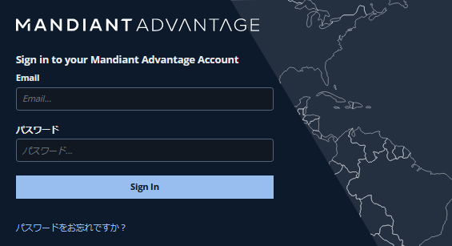
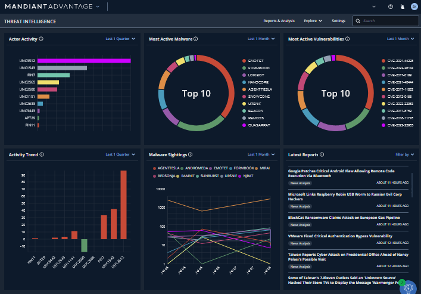
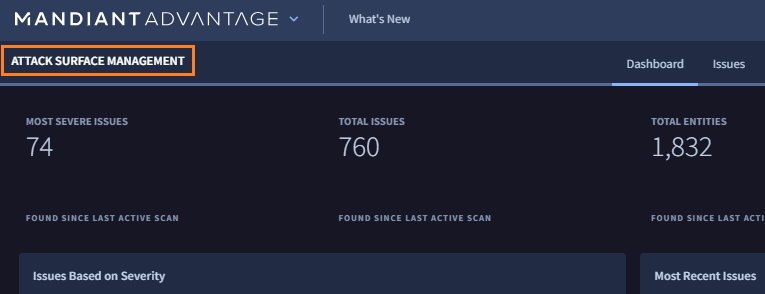

# 1. ASMへのアクセス

## Mandiant Advantage ポータルへの接続

---

１．ブラウザで  [https://advantage.mandiant.com/](https://advantage.mandiant.com/) にアクセスします

２．イベント主催者から提供されたアカウントでログインします

!!! Info
    イベントによっては、ID(Email)とパスワードの他に２要素認証トークンも提供されます。２要素認証トークンは、ログインごとに１つずつ、順番に利用する必要があるので注意してください。（１度利用したトークンは無効になります）

３．ログインが成功すると下記画面が表示されます。Mandiant Advantage Threat Intelligenceをクリックします。

## Attack Surface Management への移動

----

４．画面左上のスイッチャーをクリックし、**Attack Surface Management** をクリックします

５．画面左上の表示が Attack Surface Management となり、ASM画面に移動していることを確認します

６．このステップは終了です。[次のステップ](../02-configuration-check) に移動します
