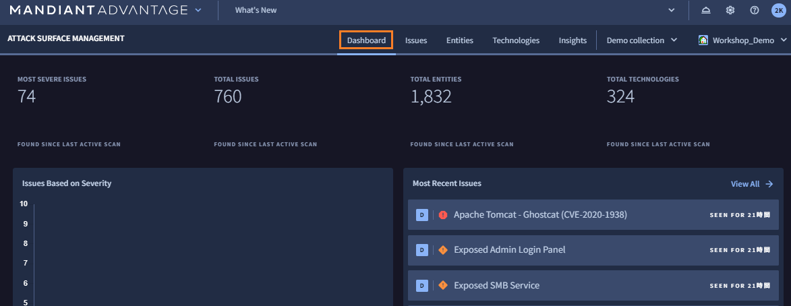
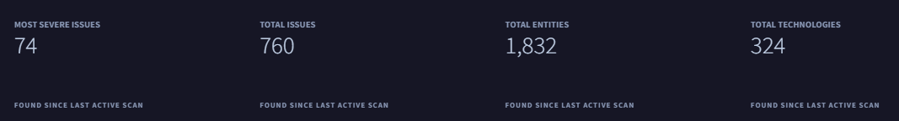
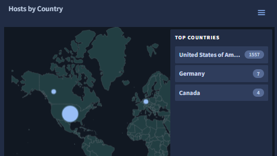
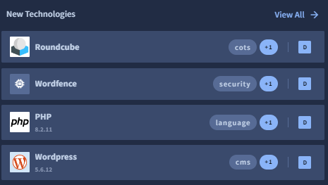
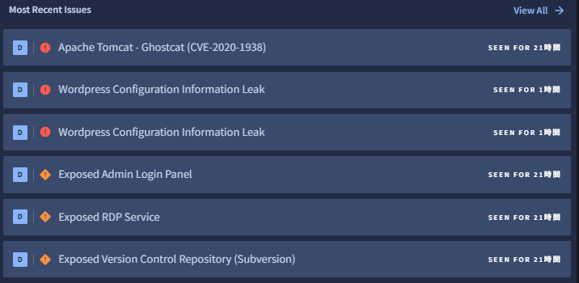

# 3. 探索結果の確認

このステップでは、デモ環境で ASM が探索した結果を確認し、アタックサーフェスの情報、可視化されたリスクを把握します

## Collection の選択

まず、これから結果を確認する Collection を選択します。

１．画面上部の **Collections** タブをクリックし、**Demo collection** のチェックボックスを選択します。これで、この Collection の探索結果のみ表示させることができます。

!!! Info
    複数の Collection を選択することもできます。また `View all collections`を選択することで、プロジェクトの全ての Collection の結果をまとめて確認することも可能です。

## Dashboard の確認

ダッシュボードで結果の概要を確認していきます。ここでは、探索で発見したアタックサーフェースの数や、時系列の変化や地理的な分布、最新の探索で発見した情報などが確認できます。

２．画面上部の **Dashboard** タブをクリックすると、下記画面が表示されます。

３．画面上部にある `Total Issues`、`Total Entities` 、`Total Technologies` の表示から、探索によって発見したセキュリティ上の問題点 (Issue)、IT資産 (Entity)、テクノロジー(Technology) の数を確認します。デモ環境では約60件の重大な問題点(`Most Sever Issues`)があるようです。

４．画面下部にある `Hosts by Country` で、どの国でどの程度Entitiesが発見されているか確認します。デモ環境では IT 資産のほとんどが北米にありますが、カナダやヨーロッパでも検出されているようです。

!!! check
    このデモ環境の組織はアメリカに本社があるため自然な結果ですが、ヨーロッパの資産はあとで確認することにします。

５．`New Technologies`で、どのような テクノロジー が最近発見されたかを確認します。デモ環境では PHPやOracle Java、WordPress といったWebメールツールが識別されています。

!!! check
    このデモ環境の組織では許可されていない古いOpenSSLも検出されているようです。あとで詳細を確認することにします。

６．最後に`Most Recent Issues`  で、どのようなリスクが最近発見されたを確認します。〇の色はリスクの重大度を示しています。デモ環境では Critical (赤)や High (橙)の Issue が検出されています。

!!! check
    Apache のパッチに関連するものや、WordPress や RDP Service など設定に関連する問題点があるようです。いずれも重大度が高いので、あとで詳細を確認することにします。

!!! Info 
    ダッシュボードの項目をクリックすることで、詳細の内容にドリルダウンすることができます。たとえば`Host by Country`で国の項目をクリックするとEntities の画面に移動し、その国でフィルタされた IT 資産の一覧をすぐ確認できます。

７．ここまでアタックサーフェスの概要をダッシュボードで確認しました。  [次のステップ](../032-check-entities1) から Entitles、Technologies、Issue について個別に確認していきます。
