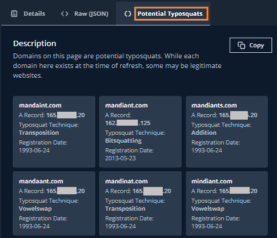

# 3. 探索結果の確認

## Entities の確認２

続いて、Web サイト以外の IT 資産について確認していきます。

１．画面上部の **Entities** タブをクリックして、Entityのトップページに戻ります

２．改めてサマリーペインを確認すると、このデモ環境では AwsS3Bucket や APIEndpoint、WebAccount なども検出されているようです。試しに **AWSS3Bucket** をクリックします。

!!! note
    ASM は Webサイトやドメインの他にも、S3バケットやコードリポジトリなど、攻撃者にとって興味の対象となるIT資産についても探索を行います。これは、探索に様々なロジックを用いていることで実現しています（ドメイン情報からDNSレコードの調査や、Webサイトの探索といった単純なものに加え、OSINTベースによる探索や、機械学習を用いた情報の紐づけなど 250 以上の情報ソースを利用しています）

３．３件の S3 バケットが検出されています。  **uploads.uservoice.com** をクリックして詳細を確認します。 

４．**Discovery Context** タブをクリックすると、この S3 バケット を ASM がどうやって検出したかを確認することができます。ここでは、デモ組織の保有 IP アドレスでホストされた Web サーバを検出した後、その Web サーバの後ろで利用されている S3 バケットを見つけたことがわかります。

５．画面右上の検索ウィンドウから、より詳細の検索を行うことができます。 Entity 一覧のページに戻り、画面右上の検索ウィンドウを選択します。
ここでは脆弱性があると推定される Entities を検索してみます。**Entities with Inferred CVEs** をクリックします。

６．表示されたリストから特定のEntittyを１つクリックして詳細画面を開き、Inferred CVE タブをクリックしてください。このEntityのソフトウェアやバージョンから推定される脆弱性が確認できます。下記の例は、 OpenSSHの古いバージョンを利用しているIT資産について、推定される脆弱性の一覧です。

７． Entity 一覧のページに戻り、Domain を確認します。左ペインのFiltersから **Domain** を選択し、特定のドメインを１つクリックして詳細を表示します。

８．**Potential Typosquats** タブをクリックします。このドメインについてタイポ・スクワッティング(Typo-Squatting)攻撃の可能性があるドメインが確認できます。

!!! info
    検索ウィンドウは様々なクエリが実行できます。クエリの詳細は [ユーザガイド](https://docs.mandiant.com/home/attack-surface-management-search-syntax) でまとめられています。

９．Entities の確認は以上です。  [次のステップ](../033-check-technologies) で Technologies について確認していきます。

