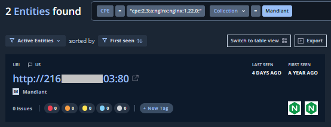
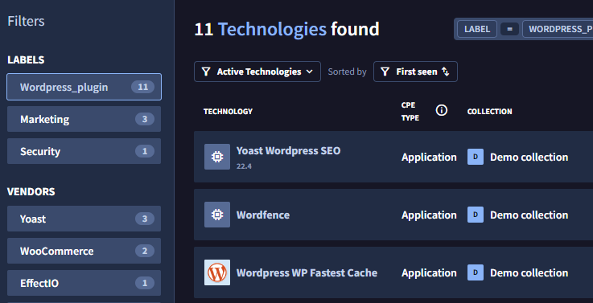

# 3. 探索結果の確認

## Technologies の確認

続いて、ASMが発見したTechnologies (=Entitiesで利用されているアプリケーションやサービス）を確認します。

１．画面上部の`Technologies` タブをクリックすると、下記画面が表示されます。

２．左ペインのFiltersを選択することで、表示するTechnologies をフィルタすることができます。**web_server** を選択して、Webアプリケーションに関連するテクノロジーを確認します。デモ環境では、Apache HTTP Server や Nginx などのソフトウェアとそのバージョンが確認できます。

３．Technologyを１つクリックすると、そのテクノロジーが利用さているEntities が確認できます。

４．Technologies 画面にもどり、左ペインのFiltersから **Wordpress_Plugin** を選択します。 Webサーバのアプリケーションだけではなく、プラグインも識別できているが確認できます。

５．左ペインのFiltersの下にある、Vendors の項目ではベンダー視点での確認ができます。各項目の数字を確認し、SaaSサービスやロードバランサーのベンダーなどの内容を確認してみてください。

６．最後に、先ほどダッシュボードで確認した「古い Openssl アプリケーション」を確認します。画面右上の検索ウィンドウに Openssl と入力すると、バージョン情報とともにアプリケーションが表示されます。このアプリケーションをクリックすると該当する Entity が表示されます。このように、古いモジュールやライブラリを利用しているIT資産を調査することができます。

Technologies の確認は以上です。[次のステップ](../034-check-issues) で Issues について確認していきます。

  

