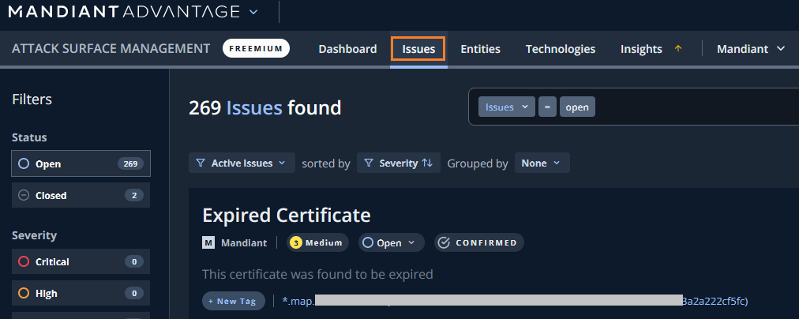
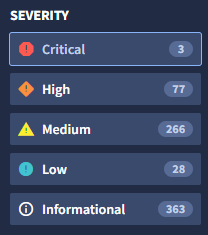
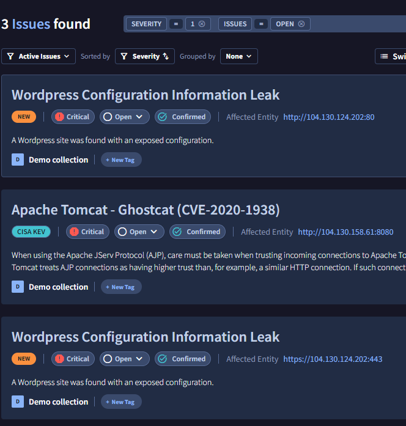
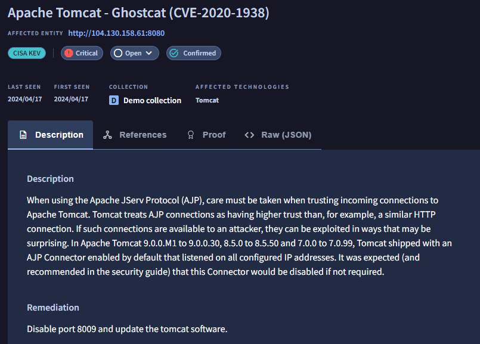
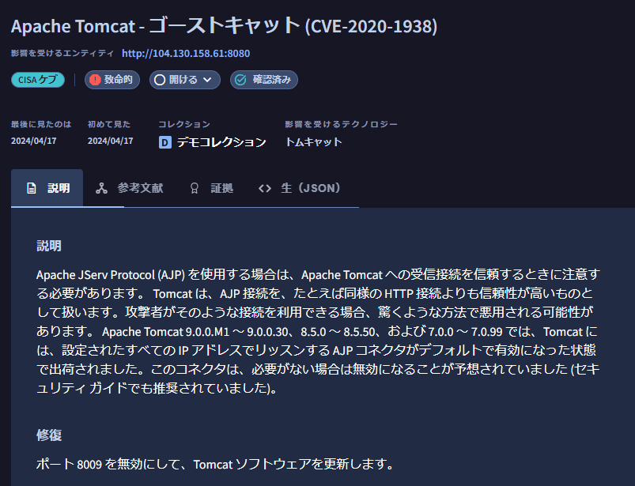
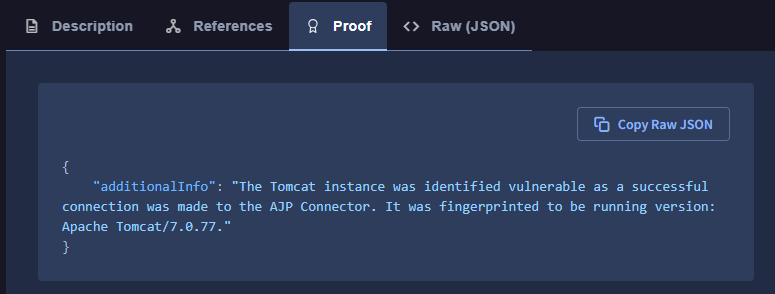

# 3.2. Issues の確認

## Issues の確認

続いて、ASMが発見したIssues (=セキュリティ視点から見た場合にリスクがある問題点）を確認します。

１．画面上部の`Issues` タブをクリックすると、下記画面が表示されます

２．左ペインの Filters を選択することで、表示するIssues をフィルタすることができます。デモ環境では３つのCritical Issue があるので、まず
この問題点から見ていきます。

３．このデモ環境では、WordPress の設定ミスと、Apache Tomcat の脆弱性が指摘されています。**Apache Tomcat - Ghostcat(CVE-2020-1983)** をクリックして詳細を確認します。

４．詳細画面では、対象となる Entity の情報とともに、このIssueの説明や対応策、参照先が確認できます。ブラウザの翻訳機能を利用して、日本語で確認することも可能です。

５．Proof タブをクリックすると、判断した根拠の情報が確認できます。

６．ここで少し時間をとって、その他にどのようなIssueが発見されているか内容や種別を確認してみてください。

!!! check
    ASM が発見するIssue は露出したサービスの他に、露出した管理画面などの設定不備、パッチ未適用による脆弱性、開発中のシステムの露出など、様々なものがあります。

８．Issue の確認は以上です。次のステップに進んでください。
