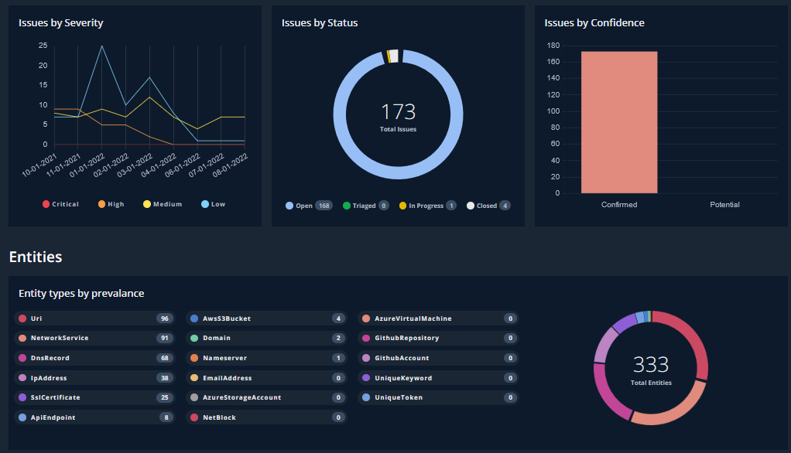
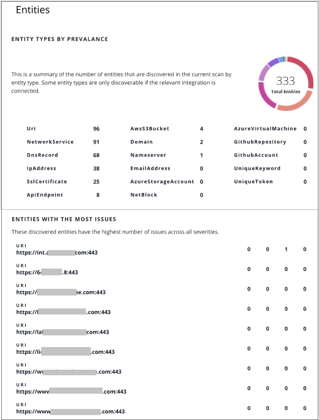

# 3. 探索結果の確認

## Insights の確認

Insights 画面では、下記の情報などをまとめて確認することができます。

- PDF レポートの作成

- 重要度が高い Issue の Top10 

- Issue が多い Entites のリスト

- Issue タイプの傾向、Entities タイプの傾向

また、レポートとして下記のようなPDFを出力可能です。

ここまで基本的なウォークスルーとして、ASMが発見したアタックフェースの確認を行いました。
