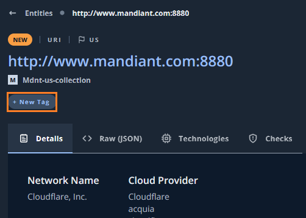
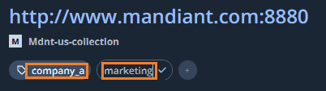
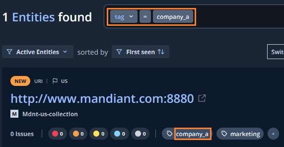
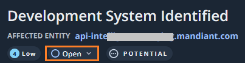
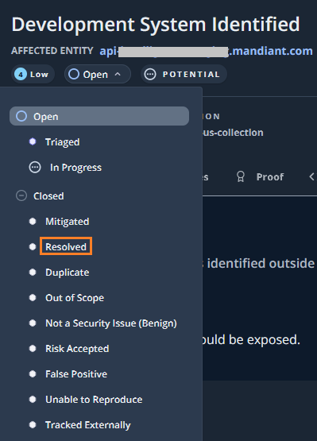
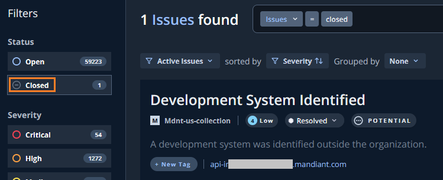

# 4. 応用編

## Tag 機能

---

ASMで発見したEntityに対して、運用のためにTagを付けて整理することができます。

１．任意の`Entitie`を選択し、`+New Tag` をクリックします

２．Tagの名前を入力します。ここでは`company_a` と`marketing`のタグを付与しています。

３．このようにTag付けされた Entitie は、検索ウィンドウで Tag 検索できるようになります。管理するグループ会社や担当部署の情報をもとにEntitiesを整理することが可能です。

## Status 機能

---

ASMで発見したIssueに対して、運用のためにステータスを設定することができます。

１．任意の`Issue`を選択し、`Open` をクリックします

２．このIssueに対するステータスを設定します。ここでは`Resolved` というステータスに変更します。

３．このように設定されたステータスの情報をもとに、Issue画面右側のFilter で検索できます。 

!!! Info
    このステータスは複数のASM管理者で共有することができます。例えば、「Issue対応を行うシステム担当者」が作業状況にあわせてステータスを変更し、「本社のセキュリティ担当者」がその確認を行うといった運用が可能です。

次のステップに進んでください。
