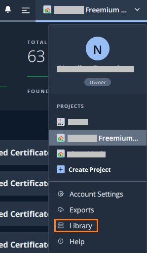
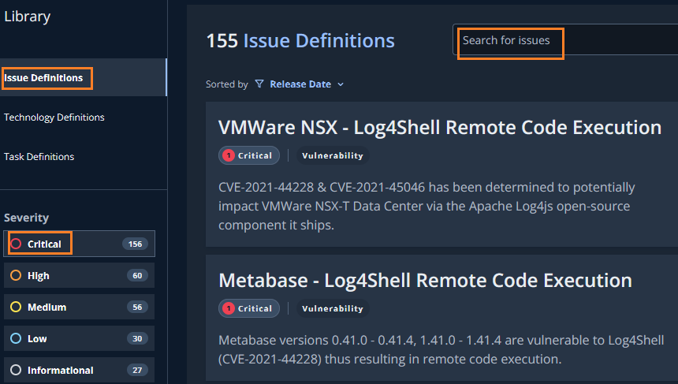
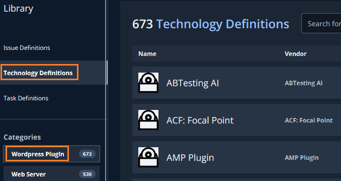
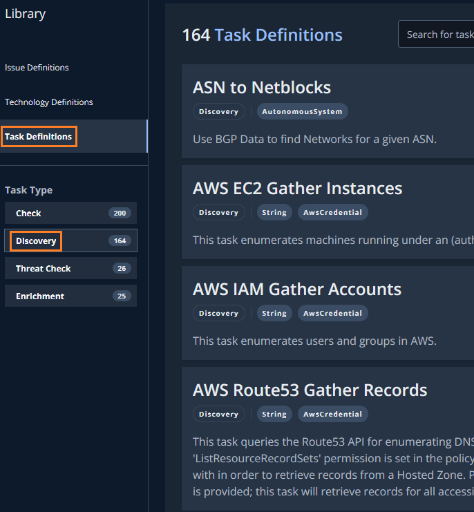
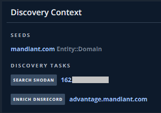

# 4. 応用編

## Libraryの確認

ASMが行う探索やリスク判定処理は、Library画面で確認することができます。  
ここでは、判定する脆弱性のリストや探索を行う仕組みなどを確認します。

１．画面上部右側のプロジェクトタブから、`Library`をクリックします。

２．左ペインの `Issue Definitions` をクリックすると、ASMが検査するIssueのリストが確認できます。重大度や検索ウィンドウでフィルタや検索が可能です。適当な脆弱性やキーワードをいれて対応状況を確認してください。

３．左ペインの `Technology Definitions` をクリックすると、ASMが判定するTechnologyのリストが確認できます。カテゴリやベンダーでのフィルタや検索ウィンドウで利用可能です。自組織で利用中のセキュリティ製品名などがあるか確認してみてください。

３．左ペインの `Task Definitions` をクリックすると、Task Type で `Discovery` を選択すると、Entity探索処理のタスクが確認できます。処理の詳細は非公開のため確認できませんが、どのような内容で探索を行っているかを簡単に確認してください。

４．この Discovery Taskは、Entitieの各ページでも表示されています。ASMがどのようなDiscovery Taskを実施し、資産を発見したかを確認できます。

５．Libraryの確認は以上です。次のステップへ進んでください。
