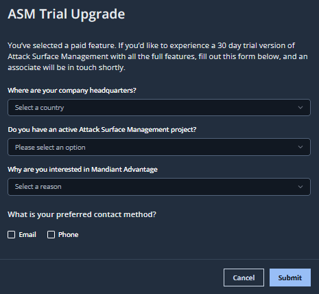

# 5. まとめ・自由時間

## ハンズオンのまとめ

---

このハンズオンでは、Mandiant ASM を操作し、参加者の組織に関連するアタックサーフェースを確認しました。最後に、ASMを利用することによるメリットを下記にまとめます。

- 外部露出しているデジタルアセットの把握と、そのセキュリティリスクの可視化

- 定期的な自動実行による、継続的なアタックサーフェース管理（毎日/毎週)

- 攻撃者視点でアタックサーフェースを管理することによる、攻撃者に先んじたセキュリティ対応の支援

- 継続的にアタックサーフェース管理による、クリティカルな脆弱性の報告などに対する緊急対応時のスムーズな影響度把握と、セキュリティ対応の優先順位付けの支援

## 

## フル機能評価プログラム

---

このハンズオンで利用した　Mandiant ASM　の <u>フル機能が30日間利用できる無料評価プログラム</u>があります。  ご希望の場合はマンディアント担当営業まで個別にご連絡ください。

![](images/2022-08-09-23-37-41-image.png

## 

# 

## クリーンアップ

---

このハンズオンのクリーンアップは特に必要ありません。ワークショップで利用した無償体験版アカウントはこのセミナー終了後も引き続き利用可能です。好きなときにいつでも再度アクセスしてください。

---

ハンズオンは以上で終了です。お疲れ様でした！
