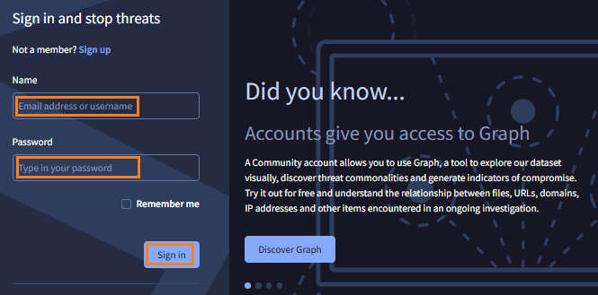
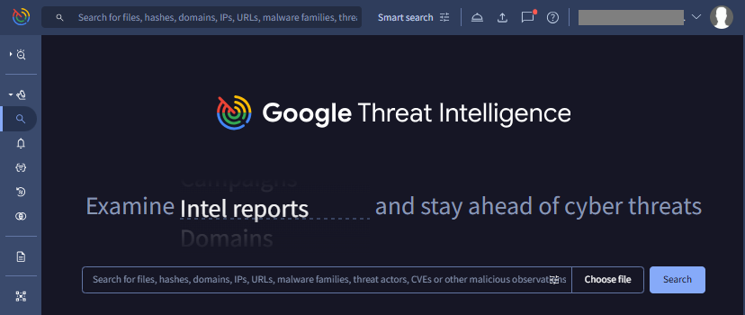
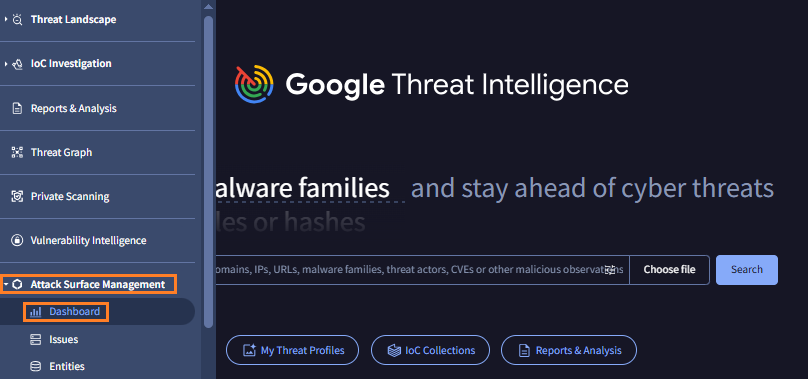
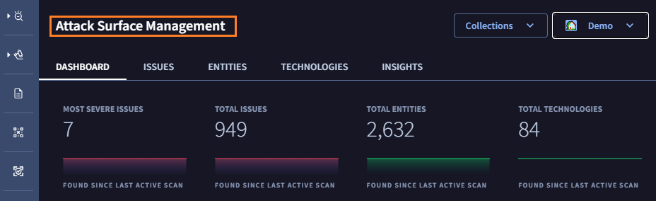

# 1. GoogleTI : ASMへのアクセス

## GoogleTI ポータルへの接続

---

１．ブラウザで  [https://www.virustotal.com/gui/sign-in](https://www.virustotal.com/gui/sign-in) にアクセスします。

２．イベント主催者から提供されたアカウントでログインします。

３．ログインが完了すると下記画面が表示されます。

## Attack Surface Management への移動

----

４．画面左のメニューバーにカーソルを合わせるとメニューが表示されます。**Attack Surface Management** を選択し、**Dashboad** をクリックします。

５．画面左上の表示が Attack Surface Management となり、ASM 画面に移動していることを確認します。

６．このステップは終了です。[次のステップ](./02-configuration-check) に移動します。
