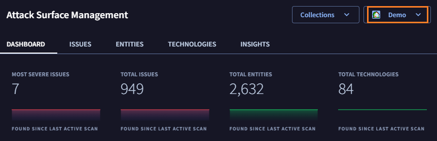
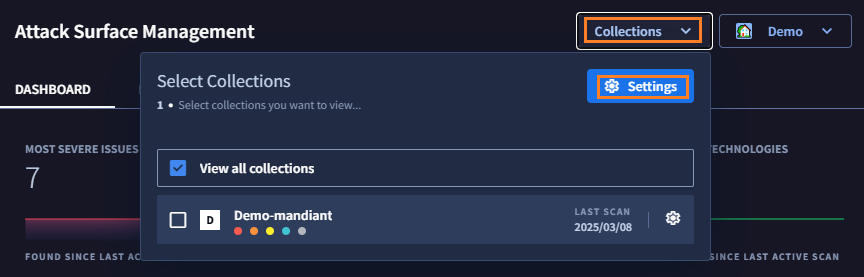
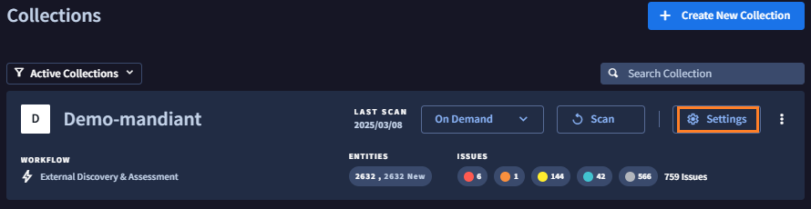
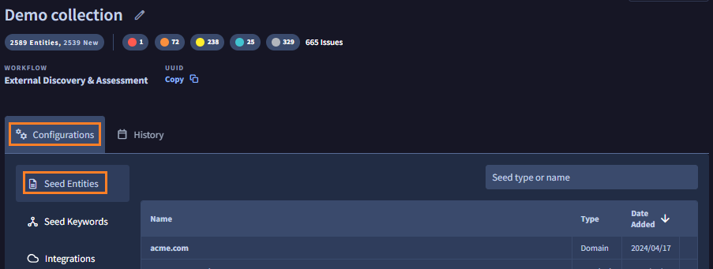
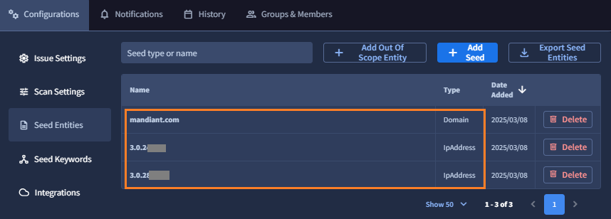
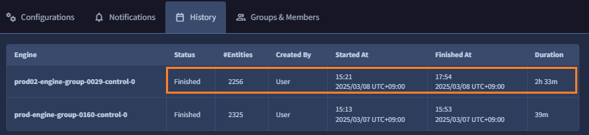

# 2. 設定の確認

このステップでは、ASM の設定方法を確認します

## プロジェクトの確認と移動

このハンズオンではデモ用プロジェクト(Demo Project)が用意されています。

画面右上のタブからプロジェクトの移動が可能です。ここから、デモ用プロジェクトを使って ASM の一般的な設定方法を確認していきます。

１．画面右上のプロジェクトタブを開くとリストが表示されます。デモ用プロジェクト（`Demo`）が選択されていることを確認します。

## Collection / Seed の確認

このプロジェクトには ASM がアタックサーフェースの探索を行うための設定(Collection)があらかじめ作成されています。まず最初に、探索の起点となる設定(Seed) を確認します。

２．画面上部の **Collections** タブから **Settings** ボタンをクリックします

３．事前登録されたCollection (`Demo-mandiant`) の **Settings** をクリックします

４．`Configurations` タブの **Seed Entities **をクリックします

５．事前設定された Seed を確認します。ここでは組織のドメイン名(mandiant.com)と、組織が保有しているグローバルIPアドレスが登録されていることがわかります。

## 探索履歴の確認

ASM が行った探索の履歴を確認します。この探索には設定された Seed の情報が利用されています。

６．**History** タブをクリックすると、探索履歴が表示されます。ここでは事前にスキャンが実施されて、探索が正常終了していることがわかります。

!!! check 
    タスクの正常終了は、Status が Finished になっていることで確認できます。その他にも、開始時間や探索時間、探索試行数などが表示があることを確認してください。

７．このステップは終了です。[<u>次のステップ</u>](../031-check-dashboard) に移動します。
