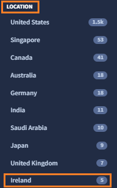

# 3. 探索結果の確認

## Entities の確認

続いて、ASMが発見した Entities (= 外部露出している IT 資産）を確認します。

１．画面上部の **Entities** タブをクリックすると、下記画面が表示されます。

２．左ペインのFiltersを選択することで、表示する Entities をフィルタすることができます。試しに**DNSRecord** を選択して、DNSレコードのみを表示します。デモ環境のドメイン(mandiant.com)に関連するDNSレコードが確認できます。

３．次に、デモ組織に関連する Web サイトを確認してみます。左ペインのFiltersから、<u>DNSRecord の選択を解除し</u>、**URL** を選択します。デモ組織に関連する Web サイトのURLが1300件程度表示されます。

!!! warning
    Filters で新しく条件を設定する時は、すでに選択している Filter をクリックし解除するのを忘れないでください。

４．Webサイトの数が多いのでテーブルビューに表示を変更します。画面右上の **Switch To Table View** をクリックすると表示が切り替わり、名前(Name)のほかに Web ページのタイトル(Title)や HTTPレスポンスのコード(Code)なども確認できます。また、**Name** をクリックすることでソートができ、ドメインベースのURLをリスト上部に表示させることもできます。

５．ここから、先ほどダッシュボードで確認した「ヨーロッパのIT資産」を確認していきます。<u>URIの選択を解除し</u>、画面右側の `Search Summary` を確認します。このサマリーペインでは Entityの種別や、リスク重大度、位置情報などの統計情報が確認できます。`LOCATION`の **Show More** をクリックし、**Ireland** をクリックします。

６．5つの Entity が表示されました。この IT 資産がアイルランドに存在しているようです。mwise.mandiant.com というWebサイトがあるので、**hxxps://mwise.mandiant.com**  の Entity をクリックして詳細を確認します。

!!! note
    WebサイトのEntity(URL)はドメインベースのURLから確認すると効率的です。これは、ドメインベースURLがサイトの内容を確認しやすい一方、IPアドレスベースのURLはCDN等によって動的に変化したもので、調査するとドメインベースURLと同一サイトであるケースが多いためです。

８．`Network Name` を確認すると Amazon Web Services にホスティングされており、 「mWISE Cybersecurity Conference」 というタイトル(Title)のサイトで、HTTPレスポンスコード(Code)200を返していることから現在稼働しているようです。

９．また、画面右下のScreenShotをクリックすると、このWebサイトのページの画像も確認できます。

１０．Webサーバのコンテンツの情報に加えて、その他の情報も確認していきます。**Technologies** タブを選択すると、このWebサイトが利用しているソフトウェアなどがcpe形式で表示されます。このサイトでは jquery や bootstrap、 new_relic や AWS-ELB などが使われているようです。

１１．  また **Checks** タブを選択すると、この Entity に対して実施したセキュリティチェックも確認できます。リンク切れのチェックといった簡単なものから、Heartbleed の脆弱性チェックまで行われています。

!!! info
    このセキュリティチェックで問題があった場合は Issue が作成されます。Issue が作成されなかった場合は、チェックの結果問題がなかったことを意味します。

１２．このサイトは以前から把握しているもので、（SSL/TLSで古い暗号方式を使っているものの）特にセキュリティ上のリスクはなく問題ないと判断しました。

    

​    

  [次のステップ](../033-check-technologies) で、Technologies について、確認していきます。

