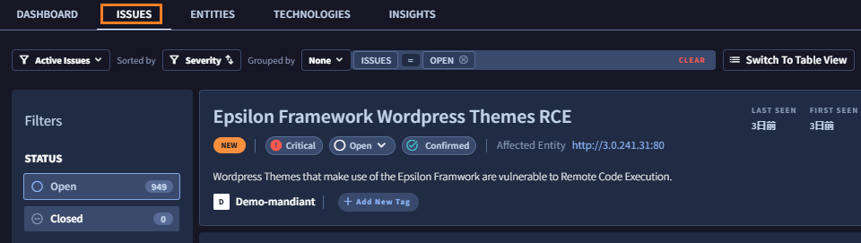
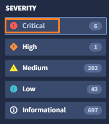
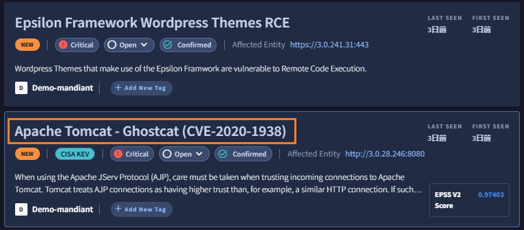
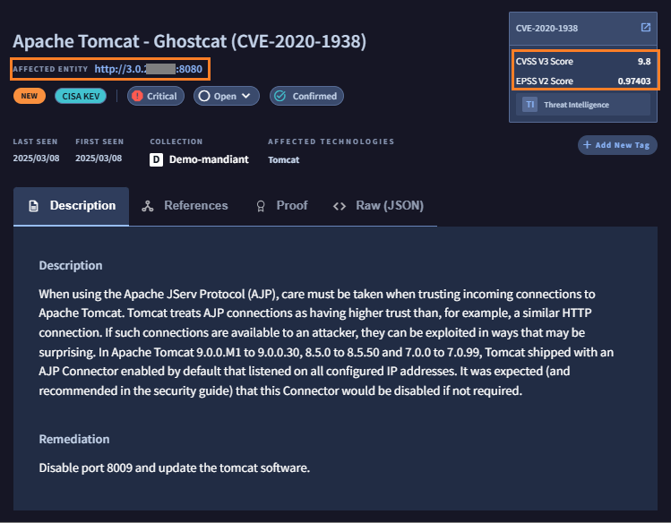
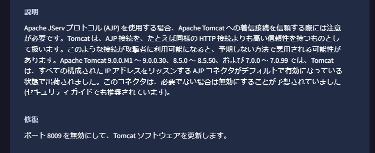
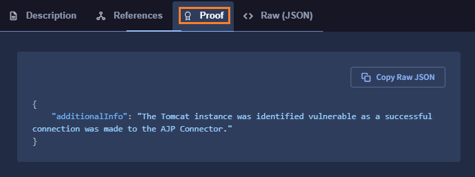
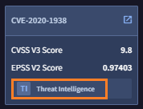
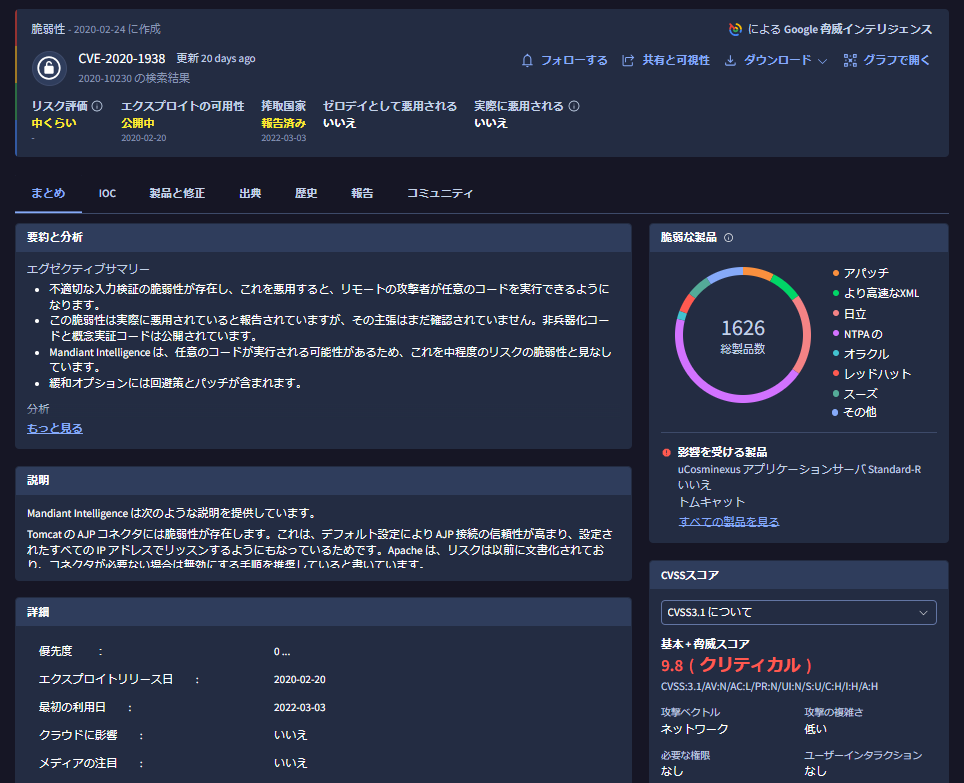

# 3. 探索結果の確認

## Issues の確認

続いて、ASMが発見したIssues (=セキュリティ視点から見た場合にリスクがある問題点）を確認します。

１．画面上部の`Issues` タブをクリックすると、下記画面が表示されます

２．左ペインの Filters を選択することで、表示するIssues をフィルタすることができます。デモ環境では３つのCritical Issue があるので、まず
この問題点から見ていきます。**Critical** の部分をクリックします。

３．このデモ環境では、WordPress Epsilon の脆弱性と、Apache Tomcat の脆弱性が指摘されています。**Apache Tomcat - Ghostcat(CVE-2020-1983)** をクリックして詳細を確認します。

４．詳細画面では、対象となる Entity の情報とともに、このIssueの説明や対応策、CVSSスコアなどが確認できます。ブラウザの翻訳機能を利用して、日本語で確認することも可能です。

５．Proof タブをクリックすると、判断した根拠の情報が確認できます。

６．GoogleTI 脅威インテリジェンスの機能と連携して、より詳細の脆弱性情報を確認することも可能です。画面右上のCVSSスコアの枠にある **Threat Intelligence **ボタンをクリックします。

!!! memo
    GoogleTI の脅威インテリジェンスの機能は、GoogleTI Enterprise 以上のライセンスで利用可能です。

７．別ウィンドウが開き、GoogleTI 脅威インテリジェンスでの CVE-2020-1983 の情報が表示されます。（画面はブラウザの翻訳機能を利用したものです）。対象となる製品やエクスプロイトの有無、この攻撃が利用されたIoCやレポートが確認できます。

!!! memo
    この脆弱性 ( Apache Tomcat - Ghostcat CVE-2020-1983 )は、CVSSv3.1スコアでは9.8(クリティカル)と評価されている一方、GoogleTI 脆弱性インテリジェンスでは MEDIUM と評価されています。これは単純な脆弱性の影響度だけではなく、悪用の実現性や活発さを踏まえ、現実に即したリスク評価を行っているのが理由です。

８．ここで少し時間をとって、ASMでその他にどのようなIssueが発見されているか内容や種別を確認してみてください。

!!! check
    ASM が発見するIssue は露出したサービスの他に、露出した管理画面などの設定不備、パッチ未適用による脆弱性、開発中のシステムの露出など、様々なものがあります。

８．Issue の確認は以上です。[次のステップ](../035-check-insights) に進んでください。
