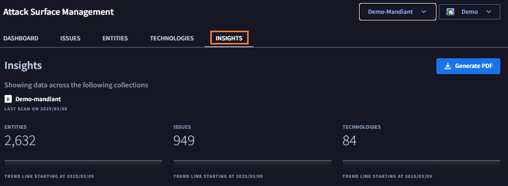
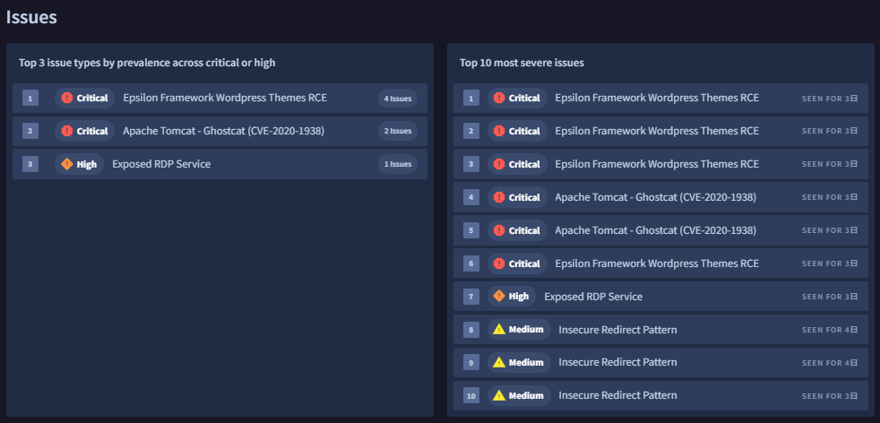
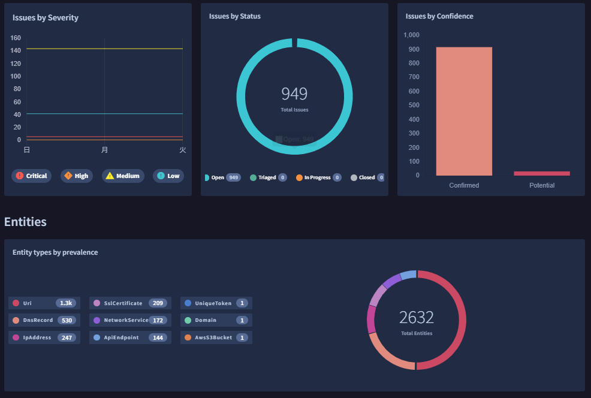
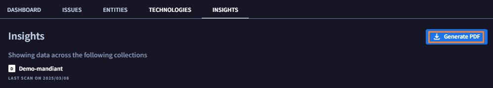
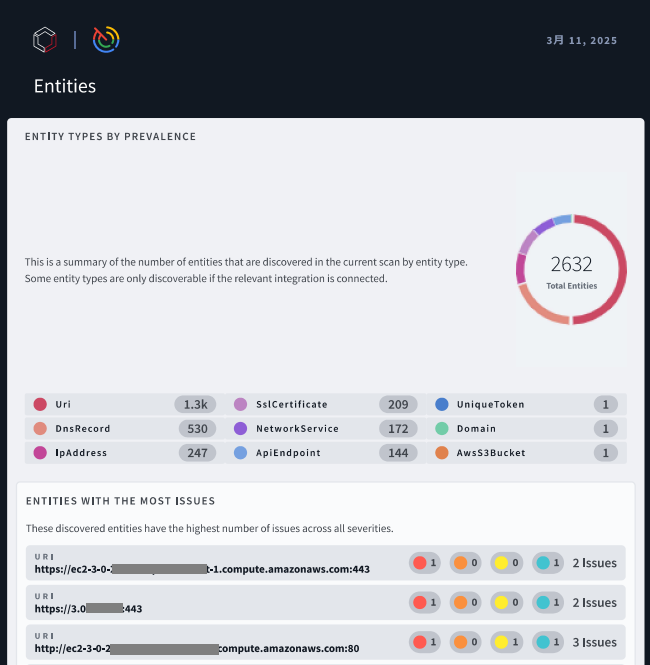

# 3. 探索結果の確認

## Insights の確認

Insights 画面では、下記の情報などをまとめて確認することができます。

１．画面上部の`Insights` タブをクリックすると、下記画面が表示されます

２．今まで各ページで確認した内容が、レポートにまとめられています。一通り内容を確認してください。

!!! check
    Insights レポートでは、下記の情報などをまとめて確認することができます。「重要度が高い Issue の Top10 」、「Issue が多い Entity のリスト」、「Issue タイプの傾向」、「Entities タイプの傾向」など。

３．画面右上の **Generate PDF** ボタンをクリックすると、PDF形式のレポートがダウンロードできます。

ここまで基本的なウォークスルーとして、ASMが発見するアタックフェースの確認を行いました。[次のステップ](../041-adv-export) に進んでください。
