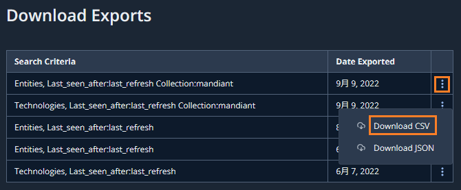

# 4. 応用編

このステップでは応用編として、運用に役立つ機能、動作の仕組みを確認します。

## Export 機能

---

ASMで発見した情報 (Entities, Technologies, Issue) はCSVやJSONファイルとして出力することができます。

１．画面上部の`Entities` タブをクリックすると、下記画面が表示されます。

２．画面右上にある`Export` ボタンをクリックすると、画面右下に処理開始のメッセージが表示されます。

３．画面上部右側のプロジェクトタブ`Entities` から、`Exports`をクリックします。

４．ダウンロード可能なファイルが表示されます。一番上のある最新のExport結果の選択ボタンをクリックし、Download CSV をクリックすると、先ほどExport処理を行ったファイルをダウンロードできます。

５．エクスポートしたファイルは下記のようになります。組織のIT管理(資産管理など)やセキュリティ対策（脆弱性診断など)へのインプットとして利用可能です。

!!! TIPS
    ASM の API を利用することで同様の情報をプログラムから取得し、自動的な処理を行うことも可能です。

６．Export 機能の確認は以上です。[次のステップ](../042-adv-operation)に進んでください。
