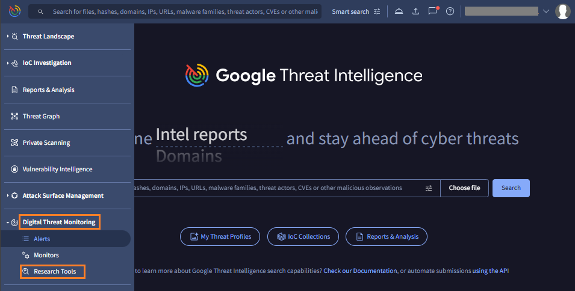
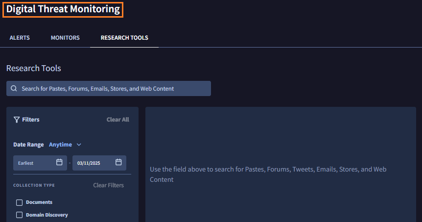

# 1. GoogleTI : DTM へのアクセス

## GoogleTI ポータルへの接続

---

!!! Info 
    GoogleTI ポータルにアクセス済みの場合は、1-3 を省略可能です。

１．ブラウザで  [https://www.virustotal.com/gui/sign-in](https://www.virustotal.com/gui/sign-in) にアクセスします。

２．イベント主催者から提供されたアカウントでログインします。

３．ログインが完了すると下記画面が表示されます。

## Digital Threat Monitoring への移動

----

４．画面左のメニューバーにカーソルを合わせるとメニューが表示されます。**Digital Threat Monitoring** を選択し、**Research Tools** をクリックします。

５．画面左上の表示が Digital Threat Monitoring となり、DTM 画面に移動していることを確認します。

６．このステップは終了です。[次のステップ](../051-dtm-search) に移動します。
