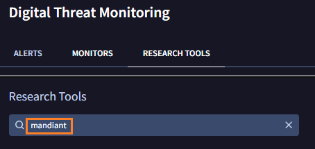
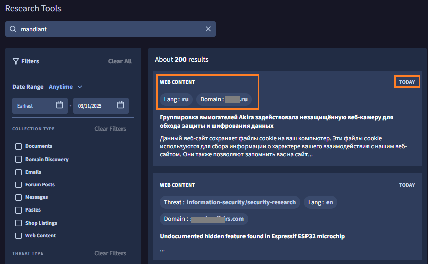
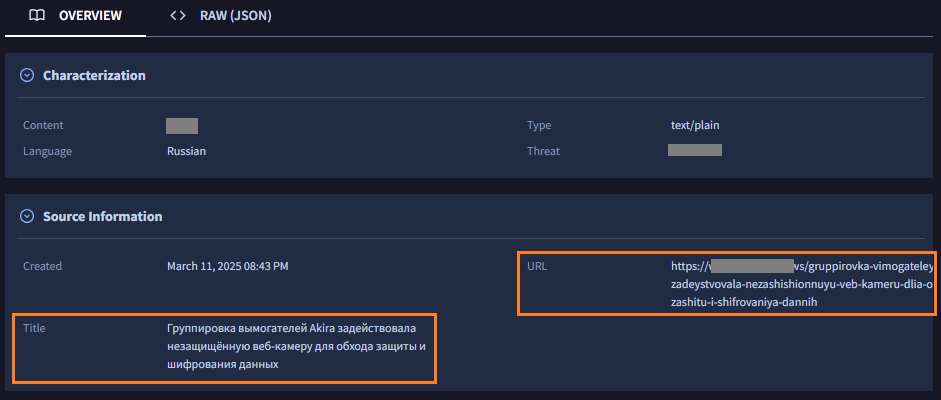
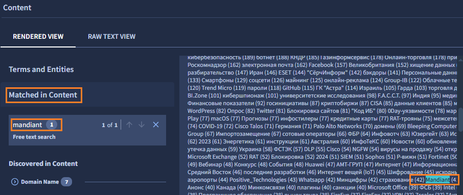
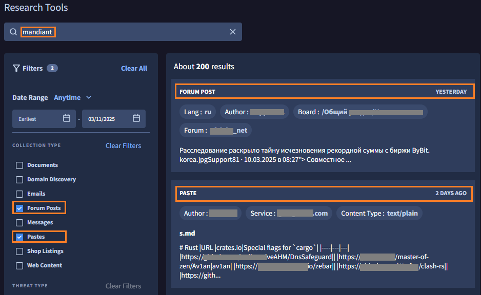
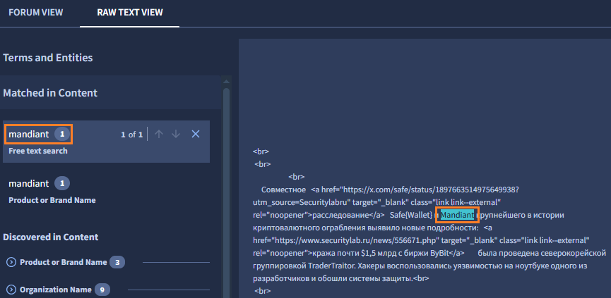
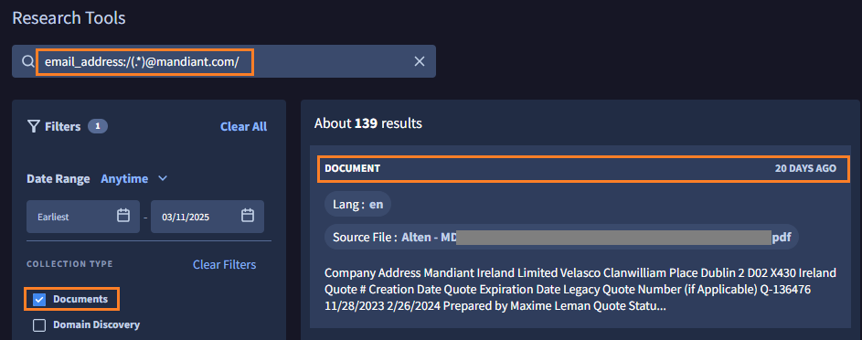
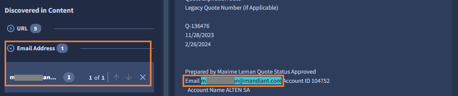

# 2. 検索

このステップでは、Research Tool を使ってダークウェブの検索を行います。

## Research Tool を使った検索

１．`Research Tools` の検索ウィンドウに検索したいキーワードを入力します。ここでは自社名の例として **mandiant** を入力して実行します。

２．しばらく待つと結果が表示されます。検索結果は200件あることが確認できます。また、本日 Webサイト上 (Web Content)  に "Mandiant" に言及されたポストがあったようです。言語はロシア語、ドメインは .ru となっています。

３．項目をクリックすると、詳細が表示されます。`Source Information` の項目で、作成日時やURL、このページのタイトルが確認できます。

!!! memo
    情報は常に更新されるため、検索結果が異なる場合があります。その場合は、検索結果の１つを選択してください。

４．画面下の`Content` 項目で、Mandiant が言及された場所を確認できます。画面左側の`Matched in Content` で **mandiant** を選択すると、右側に表示されたページ本文の内容から該当箇所がハイライトされます。(タイトル名から、このサイトはAkiraランサムウェアについての情報のようです)

!!! check 
    その他にも、ドメイン名や、攻撃者グループの名前、脅威名（ランサムウェア名など）で簡単に該当箇所をハイライトできます。

５．一般的なWebサイトではなく、フォーラムサイトやペーストサイトやなど、サイバー攻撃で利用される特定用途のサイトにしぼって検索を行います。画面左側の `Filters` 画面から `Collection Type` で **Forum Posts** と **Pates** を選択した後、検索キーワード **Mandiant**で検索します。

６．検索結果をクリックすると、同様に詳細が確認できます。ここでは、あるフォーラムサイトで Mandiant の言及が昨日行われたようです。

７．さらに条件をしぼって、「Mandiant社のメールアドレス」を対象に検索します。検索画面にもどり、左側の `Filters` 画面から `Collection Type` で **Documents** を選択した後、検索キーワード **email_address:/(.*)@mandiant.com/ **で検索します。

８．検索結果をクリックすると、同様に詳細が確認できます。20日前に、 Mandiant社のメールアドレスが記載されたドキュメントがあるサイトで公開されたようです。

!!! check 
    DTM は単純に文字列をデータベースに保存しているのではなく、内容を分析して情報を格納しています。これにより、メールアドレスなどの情報にしぼった検索をサポートしています。

９．Research Tool を使ったダークウェブの検索方法を確認しました。ここですこし時間をとって、自社に関連するキーワードで検索をためしてみてください。

!!! check 
    DTM には手動の検索だけではなく、継続的な監視機能（モニタ機能）もあります。事前に検索キーワードや検索対象を指定しておけば、DTMデータベースに登録された時点でアラート通知を行い、内容を確認することができます。

１０．[<u>まとめ</u>](../06-summary) に移動します。
