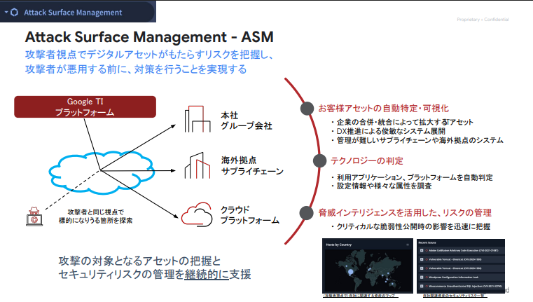
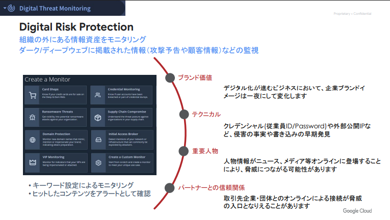

# ASM / DTM 機能コース

このコースでは、ASM 機能 = 組織に関連するアタックサーフェス(攻撃対象領域)の確認、DTM 機能 = ダークウェブへの露出情報を確認します。 ASM によって「自社の<u>IT資産</u>の外部への露出状況」、DTM によって「自社の<u>情報資産</u>の露出状況」をそれぞれ監視することができます。

##  ASM の機能

##  DTM の機能

## ハンズオンの流れ

このハンズオンは６つのステップに分かれています。

- **ステップ１ - ASM へのアクセス**  
  GoogleTI プラットフォームにログインし、 ASM にアクセスします
- **ステップ２ - 設定の確認**  
  デモ環境で ASM の一般的な設定方法を確認します
- **ステップ３ - 探索結果の確認**  
  デモ環境で ASM が探索した結果を確認し、アタックサーフェスの情報や、発見したリスクを把握します
- **ステップ４ - 応用編**  
  運用に役立つ機能や、動作の仕組みを確認します
- **ステップ５ - DTM によるダークウェブ監視**  
  DTM にアクセスし、ダークウェブなどで自社の関連情報を確認します
- **ステップ６- まとめ** 

!!! warning
    このハンズオンで確認できるアタックサーフェス情報とダークウェブ情報は、 GoogleTI 活用の体験を目的としております。アタックサーフェスやダークウェブの情報提供自体を目的としたものではありません。

[ステップ１](./01-environment-access) に移動します
