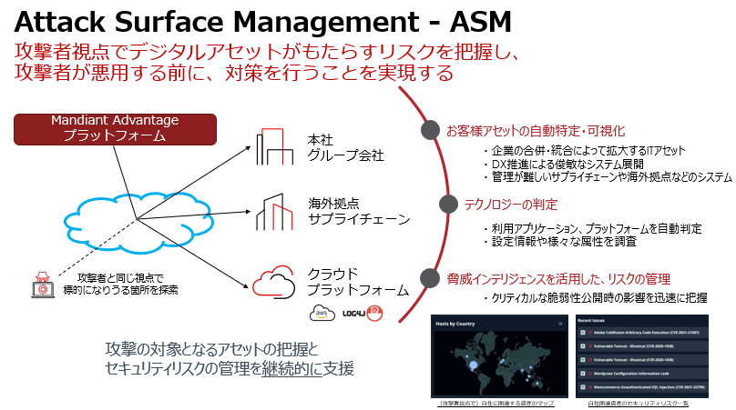

# ASM / DTM 機能コース

Mandiant Attack Surface Management (ASM) コース

このコースでは、ASM機能 = 組織に関連するアタックサーフェス(攻撃対象領域)の確認、DTM機能 = ダークウェブへの露出情報を確認します。 

## Mandiant ASM の機能

## ハンズオンの流れ

このハンズオンは６つのステップに分かれています。

- **ステップ１ - ASMへのアクセス**  
  Mandiant Advantage プラットフォームと ASM へ接続します
- **ステップ２ - 設定の確認**  
  デモ環境で ASM の一般的な設定方法を確認します
- **ステップ３ - 探索結果の確認**  
  デモ環境で ASM が探索した結果を確認し、アタックサーフェスの情報や、可視化されたリスクを把握します
- **ステップ４ - 自組織の状況確認**  
  参加者の自組織について、ASMが探索した結果を確認します
- **ステップ５ - 応用編**  
  運用に役立つ機能や、動作の仕組みを確認します
- **ステップ６- まとめ** 

!!! warning
    このハンズオンで確認できるアタックサーフェスの情報は ASM の活用方法の体験を目的としており、アタックサーフェスの情報提供自体を目的としたものではありませんのでご注意ください。

[ステップ１](./01-environment-access) に移動します
